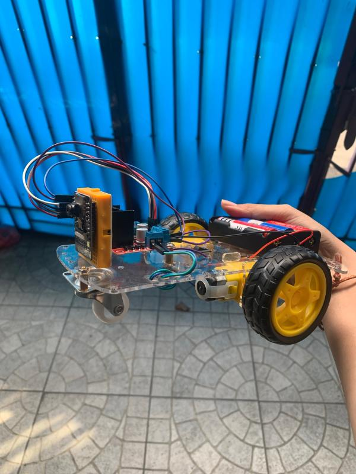
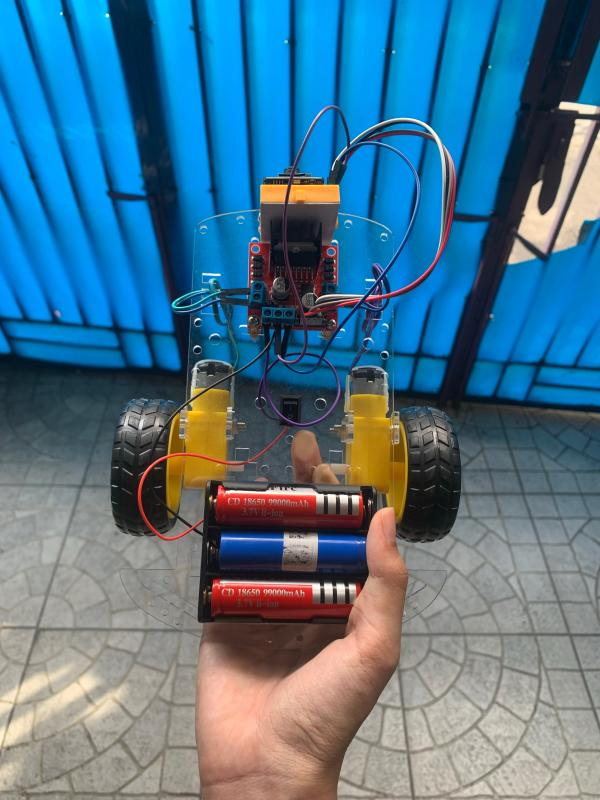
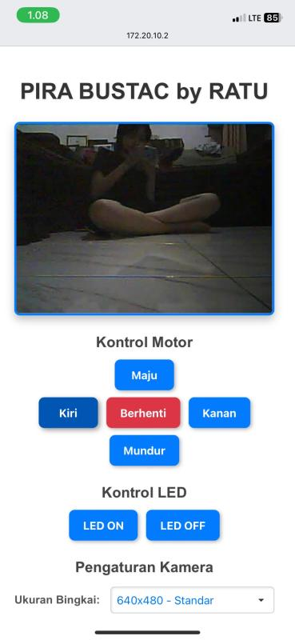
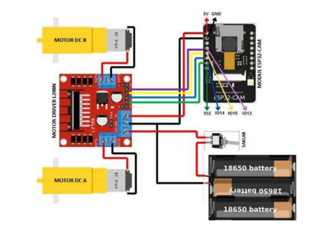

# 🤖 ESP32-CAM Area Monitoring Robot

A mobile monitoring robot built using **ESP32-CAM** for real-time video surveillance and remote movement control through a web interface.

This project was developed to explore the integration of embedded systems, IoT, wireless communication, and real-time camera monitoring.

## ✨ Features

- 📷 Real-time video streaming using ESP32-CAM
- 🎮 Web-based remote movement control
- ⬆️ Move forward
- ⬇️ Move backward
- ⬅️ Turn left
- ➡️ Turn right
- 🛑 Stop control
- 💡 Flash LED control
- 📶 Wireless control through Wi-Fi
- 🌐 Accessible directly from a web browser

## 🔧 Hardware

- ESP32-CAM AI Thinker
- L298N Motor Driver
- DC Motors
- Robot chassis
- Battery / power supply
- Jumper wires

## 💻 Technologies

- ESP32
- Arduino IDE
- C / C++
- HTML
- CSS
- JavaScript
- HTTP Web Server
- Wi-Fi

## ⚙️ How It Works

The ESP32-CAM connects to a Wi-Fi network and hosts a local web server.

Users can access the robot through its local IP address using a web browser. The web interface provides real-time camera streaming and movement controls, allowing the robot to be operated remotely while monitoring the surrounding area.

## 📷 Project Preview

### Robot Hardware

<p align="center">
  
  
</p>

### Web Control Interface

<p align="center">
  
</p>

The web interface provides real-time video streaming and remote control of the robot's movement, flash LED, and camera settings.

### Wiring Diagram

<p align="center">
  
</p>
## 🔐 Configuration

Before uploading the program to the ESP32-CAM, configure your Wi-Fi credentials:

```cpp
const char* ssid = "YOUR_WIFI_NAME";
const char* password = "YOUR_WIFI_PASSWORD";
